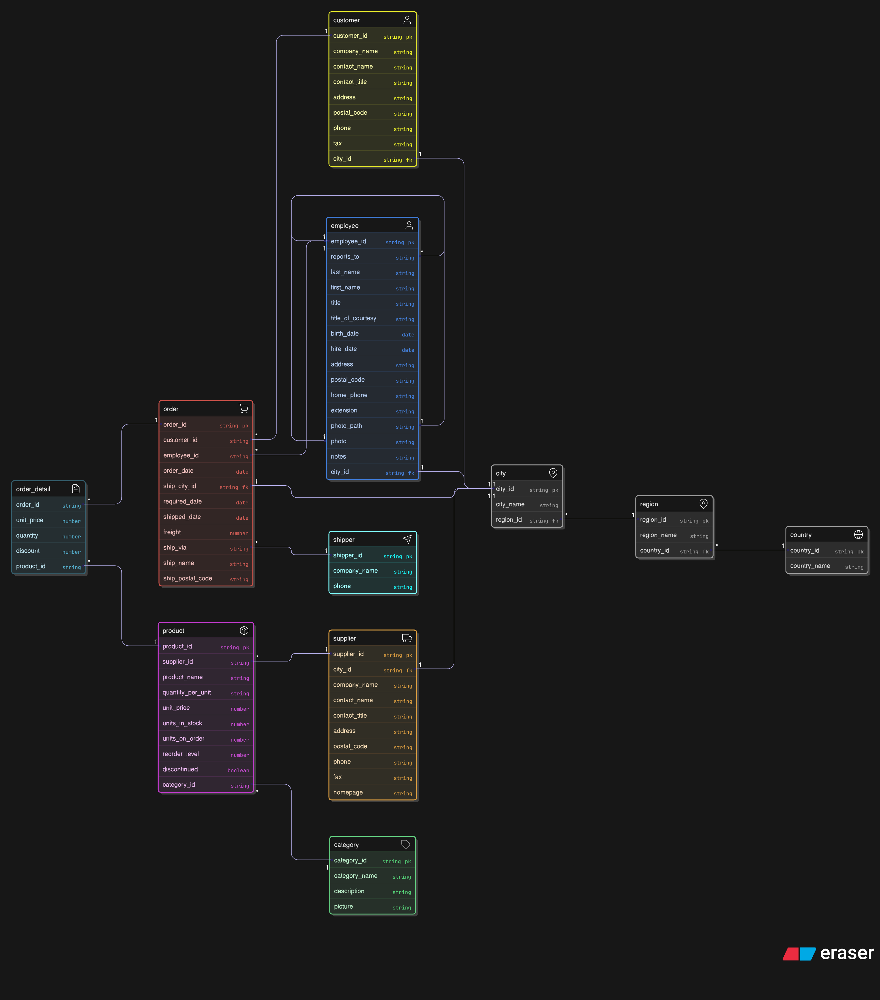

# Text2SQL Analytics System

## Quickstart (local)

1. Create a Python 3.10+ virtual environment and activate it.
   ```bash
   python3 -m venv .venv
   source .venv/bin/activate   # macOS / Linux
   .venv\Scripts\activate    # Windows (PowerShell)
   ```
2. Install dependencies:
   ```bash
   pip install -r requirements.txt
   ```
3. Fill `.env` based on `.env.example` and start a local Postgres (or Docker Compose).
4. Use `scripts/setup_database.py` to prepare schema and optionally load CSVs.
5. Use `run_query.py` to try sample queries (currently uses mocked LLM responses).

## Project Structure

```bash
text2sql-analytics/
├── README.md
├── requirements.txt
├── .env.example
├── .gitignore
├── setup.py
├── data/
│   ├── raw/
│   │   └── northwind.xlsx
│   └── schema/
│       └── schema.sql
├── src/
│   ├── __init__.py
│   ├── config.py
│   ├── data_loader.py
│   ├── database.py
│   ├── text2sql_engine.py
│   ├── query_validator.py
│   └── utils.py
├── tests/
│   ├── __init__.py
│   ├── conftest.py
│   ├── test_data_loader.py
│   ├── test_database.py
│   ├── test_query_validator.py
│   ├── test_text2sql_engine.py
│   └── test_accuracy/
│       ├── test_simple_queries.py
│       ├── test_intermediate_queries.py
│       └── test_complex_queries.py
├── notebooks/
│   └── analysis.ipynb
└── scripts/
    ├── setup_database.py
    └── run_evaluation.py
```

## Database Setup

### Run with Docker Compose

1. **Ensure Docker is installed and running**

   - [Install Docker](https://docs.docker.com/get-docker/)
   - [Install Docker Compose](https://docs.docker.com/compose/install/)

2. **Start PostgreSQL via Docker Compose**

   From the project root directory:

   ```bash
   docker-compose up -d
   ```

   This will:

   - Start a PostgreSQL 17 container named `text2sql-db-1`
   - Expose port `5432`
   - Create a database `northwind_db` with user `northwind_admin` and password `northwind123`
   - Persist data inside `data/postgres/`

3. **Verify the container is running**

   ```bash
   docker ps
   ```

4. **Connect to the database**

   ```bash
   docker exec -it text2sql-db-1 psql -U northwind_admin -d northwind_db
   ```

### Environment Configuration

1. Create a `.env` file in the project root (or copy `.env.example`):

   ```bash
   cp .env.example .env
   ```

2. Update it with your local database credentials:

   ```bash
   # Example environment variables
   DB_HOST=localhost
   DB_PORT=5432
   DB_NAME=northwind_db
   DB_USER=northwind_admin
   DB_PASSWORD=northwind123
   GEMINI_API_KEY=your_gemini_api_key_here

   ```

### Verify Database Connection

To confirm the connection works:

```bash
python3 tests/test_db_connection.py
```

If you see:

```
Connected to: northwind_db
```

You’re good to go!

## Data Model

ER Diagram

[]

## Data Engineering

Load the data

```bash
python3 src/data_loader.py --excel data/raw/northwind.xlsx
```

## Testing

From root use:

```bash
pytest -v
```

## Text2SQL engine

Run

```sh
python3 src/text2sql_engine.py
```

## References

- [GenAI Doc](https://ai.google.dev/gemini-api/docs/quickstart)
